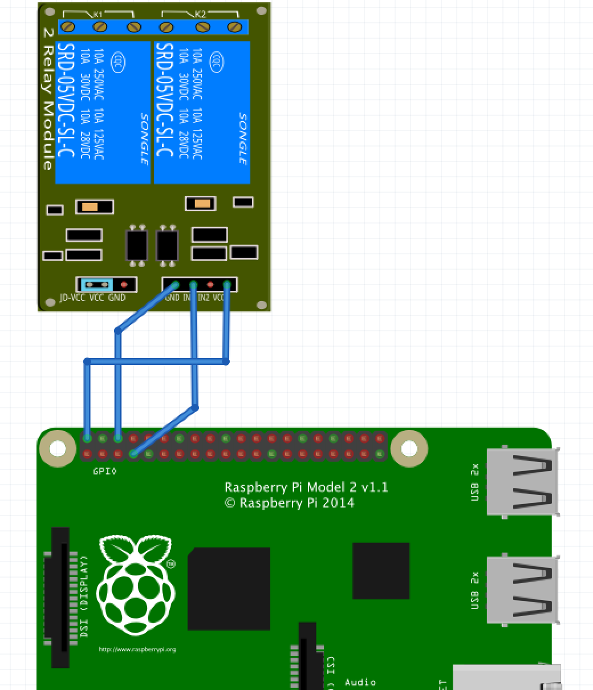

Controle de Fechadura Elétrica com Raspberry Pi
===

Introdução
---

Nesse projeto um Raspberry Pi é utilizado para controlar a abertura de 
uma fechadura elétrica.

Uma fechadura elétrica é uma fechadura de atuação mecânica que usa um solenóide
para acionar sua abertura. É muito comum em portões onde a abertura é feita 
pelo interfone ou por um botão.

Nesse vídeo explico como funciona esse tipo de fechadura:

https://www.youtube.com/watch?v=lYu4_FXZVwM

Para controlar a fechadura com um Raspberry Pi vamos usar um relê para fazer
o papel de "botão" acionador e controlar o relê através de uma porta de I/O
do Raspberry Pi.

Escolhi usar [node.js] [1] para rodar a aplicação web que dará acesso ao controle
do relê. E para ficar no mundo Javascript usei a biblioteca [onoff] [2] para
controlar a interface GPIO do Raspberry Pi.

Neste outro vídeo mostro o funcionamento do projeto:

https://www.youtube.com/watch?v=E9Cb50f-zLg

Conexões:
---

A figura abaixo indica as conexões entre o Raspberry Pi e o módulo do relê.

Referências:
---

[1]: http://weworkweplay.com/play/raspberry-pi-nodejs/ (Versão do node.js pré-compilada para Raspberry Pi)
[2]: https://www.npmjs.com/package/onoff 
[3]: Pinagem do RaspberryPi http://www.hobbytronics.co.uk/raspberry-pi-gpio-pinout
